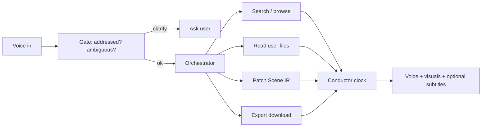

# 𝛱 Live — Product Vision

> **Bet:** Socrates feared writing because it froze thought. We bet on **live voice + live visuals** — not chat, not slide decks, not “AI video.”  
> **Surface:** one web page, full viewport, **zero chrome**.

---

## What you open

```text
┌─────────────────────────────────────────────────────────────┐
│   ambient background — personalized, always in motion        │
│                                                             │
│        ◉  presence face — your agent’s warmth & soul         │
│           (default screen until a topic needs the board)     │
│                                                             │
│   when topic starts → lesson visuals grow; face stays (corner) │
│                                                             │
│   optional: thin subtitles                                   │
└─────────────────────────────────────────────────────────────┘
   no header · no footer · no nav · no search box · no tutorial
```

**Reference UI:** `assets/references/copilot-voice-chat-reference.png` — see `PRESENCE.md`.

You **speak**. The system **shows**, **searches**, **uploads**, **exports** — without teaching you how the platform works.

---

## Primary channel

| Channel | Role |
|---------|------|
| **Voice** | Default input and output |
| **Visual** | Scene IR + live motor — timelines, maps, diagrams, news cards, code structure |
| **Text** | Subtitles (toggle by voice) · ephemeral typing zone when you insist |

**Not primary:** messages, threads, markdown chat, manual tool picking.

---

## Any subject

Same engine; different **entity catalogs** and **tool chains**.

```text
        math ──┐
        tech ──┼──► Scene IR (universal graph) ──► live renderer
   culture ──┤
    news ────┘         ▲
                       │
              agent orchestrator + live search
```

Example: you ask for **recent news** on a topic. The agent searches as it speaks, drops **cards / timelines / maps** into the scene as results arrive — not a wall of links, not a static video.

---

## Presence — warmth before content

The face is **central to conviviality**: what keeps people is often the **felt relationship**, not only the explanation.

You land on a **motion background** tuned to you (tech, culture, interests). On top: a **small expressive face** — the agent’s personality — that greets you, remembers past talks, and stays your interlocutor until a **topic** needs the visual board.

| Phase | What you see |
|-------|----------------|
| **Arrival** | Ambient field + face welcomes you |
| **Open dialogue** | Face + voice; no lesson yet |
| **Topic active** | Diagrams / cards appear; face moves aside but **stays visible** |
| **Between topics** | Face returns center; field breathes |

Full spec: **`PRESENCE.md`**.  
Do not confuse with “avatar optional” — presence is the **default human anchor**; Scene IR is the **shared mental space** when explaining.

---

## Agent in the background (autopilot with brakes)

The user never “runs a workflow.” The **orchestrator** decides tools, configs, and layout.



| Principle | Behavior |
|-----------|----------|
| **Clarify** | Misheard → “repeat?” · “spell that?” · confirm before a long run |
| **Controlled** | No headless loops; visible plan beats for long tasks |
| **Self-aware** | Knows autopilot state; user can say “stop”, “slower”, “subtitles off” |
| **Attention** | UI chrome only when needed (e.g. upload sheet **invoked by agent**) |

---

## Voice commands you described (exports)

Say it; the orchestrator queues work; browser receives a **download** when ready.

| Intent | Output |
|--------|--------|
| Visual recap of session / topic | PNG / PDF / short clip (async compile OK) |
| Written trace | `.md` summary of exchange |
| Code from discussion | `.py` or relevant files |
| “Everything we said on X” | Bundle zip |

Exports are **side effects** — the session stays immersive.

---

## User files (v1)

| In scope | Out of scope (later) |
|----------|----------------------|
| image, text, code, `.md` | video upload |

You say: *“Help me understand this course.”*  
The system **opens upload** itself — you never hunt a menu.

---

## Personalization (live)

Each user gets a **profile vector**: tech, culture, history of scenes — backgrounds and default visual tone adapt.  
Nothing is a fixed theme; the field is **generated**, not a skin pack.

---

## Mantras (non-negotiable)

```text
  ZERO CHROME     →  no manual platform learning curve
  VOICE FIRST     →  writing is the exception
  VISUAL FIRST    →  not slide video, not image chains
  CLARIFY         →  ambiguity stops the line
  PRESENCE        →  do not answer the room, answer the user
  AGENT ORCHESTRA →  tools fire in back; user stays on goal
```

---

## Relation to parent 𝛱

| Parent (`𝛱/`) | `live/` |
|----------------|---------|
| Manifest, capital, business vectors | Product + code |
| `ScienCurious/` content repo | One consumer of exports |
| `STATE_OF_THE_ART.md` | Research baseline |

---

*See `ARCHITECTURE.md` for Path A build · `SCENE_IR.md` for visual state*
